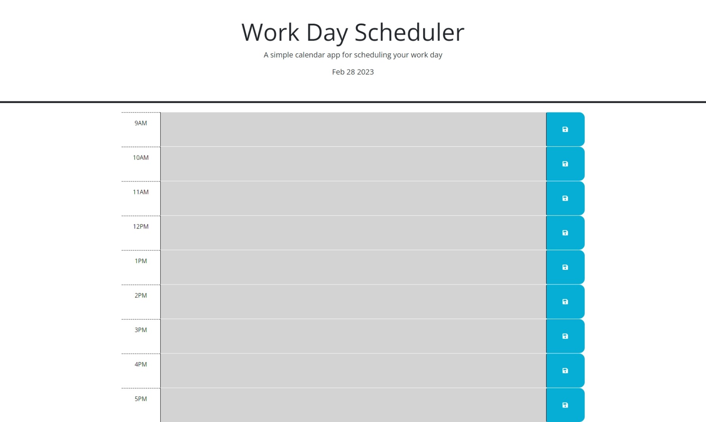

# Workday Scheduler

## Description

The purpose of this website is to allow the user to plan out the workday by typing out plans in the timeblocks. 
They can save what they type by clicking the save button. Depending on the time of day each block will be colored 
one of three colors. Clicking the save button will save text that is typed in textbox even if you close and reopen 
the page. There are nine time blocks for each hours from 9 am to 5 pm.

## Installation

No steps needed to install. Just follow this URL to get to website.
URL: https://alfredoji.github.io/work-day-scheduler/ 

## Usage

When you open the webpage you will see the title "Work day Scheduler" and under that the current date.
You will see nine timeblocks that start at 9am and end at 5pm. The user can type in the timeblocks and 
they can save the timeblocks by clicking the blue save button that is on the leftside. After clicking
the save button the timeblock is stored in local storage so the text is saved even if the user refreshes
or closes the webpage. The timeblocks also change color depending on the current time of the day. If that 
timeblock has already past the block was be the color gray. If we in the current timeblock the block will 
be the color red. And future timeblocks will be the color green.

## Image

